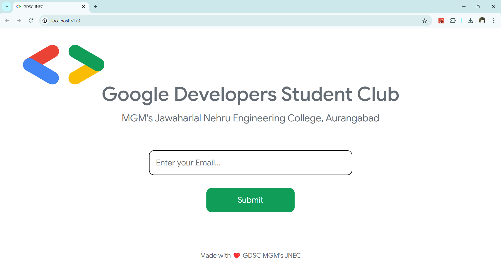

# GDSC Certificate Generator - Automate Your Participant Recognition

****

Streamline your GDSC event certificate creation process with this user-friendly Node.js and React.js web application! This app eliminates the tedious task of manually typing names, allowing you to effortlessly generate personalized certificates for all participants.

#### Key Features:

* **Automated Certificate Generation:** Streamline participant certificate creation by leveraging a participant database.
* **Easy Customization:** Customize the certificate template to match your GDSC's branding and event details. Minor code adjustments are required for specific customizations.
* **User-Friendly Interface:** Participants can easily download their certificates by entering their email address on the app's home page.

<br/>


#### Getting Started:

1. ***Prerequisites:*** 
    
    * `Postgres SQL`
    * `NodeJs`
    * `ExpressJs`
    * `ReactJS`

    <br/>

2. ***Clone the Repository:***
```bash
git clone https://github.com/gdsc-mgmsjnec/certificate-generator.git
```

<br/>

3. ***Install Dependencies:***
```bash
cd gdsc-certificate-generator
npm install
```

<br/>

4. ***Configuration:*** 
    
```bash
    touch server/.env
    touch client/.env
```

* **Database:** Configure your preferred database connection details in the `server/.env` file.
<br/>
* **API Key:** Add a random API_KEY in `server/.env` and add the same value in `client/.env` file with identifier **`VITE_API_KEY`**
<br/>

* **Certificate Template:** Provide your customized certificate template (.png) in `client/public`
<br/>
* **Customization:** Make minor css adjustments within the React `Certificate.css` component and In `Certificate.jsx` change the PDF orientation `'p' or 'l'` based on your Certificate's template.

<br/>

5. ***Running the Application:***
```bash
    cd server
    node server.js
```
<br />
    Open another terminal tab or window and run

```bash
    cd client
    npm run dev
```

<br />

#### Authors

1.  *[Parth Jamkhedkar](https://www.github.com/parth-cse)*

<br />

#### License**

